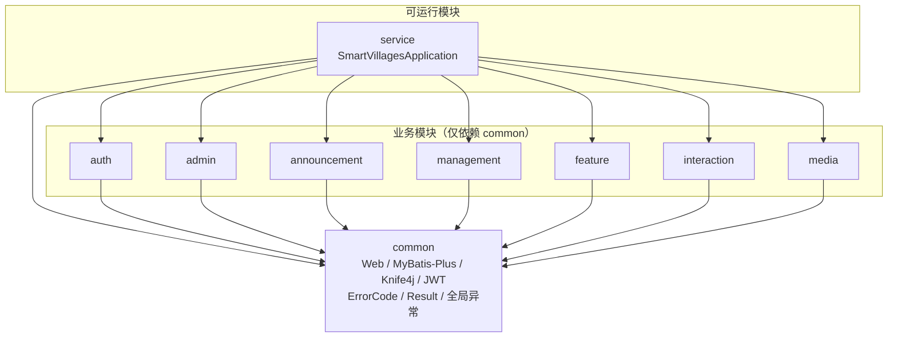

# 智慧乡村后端（smartVillages）

## 工程概览

根工程 Maven 坐标为 `com.backend:smartVillages`，采用 **多模块 + 单 Spring Boot 进程**（`service` 模块打包可执行 jar）。  
各业务 jar **只依赖 `common`**；`common` 通过依赖引入 **Spring Web、MyBatis-Plus、Knife4j(OpenAPI3)、JJWT**，并提供 **`ErrorCode`、`Result`、`GlobalExceptionHandler`、`JwtUtils`、`JwtAuthenticationFilter`** 等（详见 `common/pom.xml` 与源码）。根包名为 **`com.backend.*`**。

> **与代码严格对齐**：下列各模块的「核心功能」多为**领域与表结构已规划**的能力说明；**是否已在对应 `controller`/`service` 中实现，以仓库源文件为准**。`common` 与子模块中存在的 **空类、TODO** 表示尚未补全，本文**不将其描述为已交付功能**。

### 统一返回与错误约定

| 能力 | 位置（`common`） | 说明 |
|------|------------------|------|
| **ErrorCode** | `enums/ErrorCode.java` | 按码段划分：`1xxx` 用户/认证，`2xxx` 权限，`3xxx` 文件/配置，`4xxx` 通用业务与村务域（`41xx` 等），`5xxx` 系统，`6xxx` 路由语义；**同一语义对应唯一数字**，新增时在对应段内递增。 |
| **Result** | `result/Result.java` | 统一 JSON 字段 **`code` / `message` / `data`**；成功常用 **`code = 200`**（见类常量 `SUCCESS_CODE`）。业务失败可在 Controller 中 `Result.fail(...)` / `Result.error(...)`，或由 **`BusinessException`** 进入全局处理器后返回（JWT 过滤器产生的 **401 不在此结构内**）。 |
| **GlobalExceptionHandler** | `exception/GlobalExceptionHandler.java` | 处理 **已进入 Spring MVC** 的异常并返回 `Result`：`BusinessException`、`MethodArgumentNotValidException`、`ConstraintViolationException`、`HttpMessageNotReadableException`、静态资源 **`NoResourceFoundException`**（404）、**`HttpRequestMethodNotSupportedException`**（405）、兜底 **`Exception`**。**不含** JWT 解析失败（见过滤器）。 |

### JWT 与接口文档（简要）

- **鉴权**（实现见 `JwtAuthenticationFilter`）：仅当 **`HttpServletRequest.getRequestURI()`**（不含 query）、在去除末尾 `/` 后规范化，**等于**或在 **`/api/user`、`/api/cadre`、`/api/admin`** 之下的子路径时，才校验请求头 **`token`**；路径以 **`/login`** 结尾（如 `/api/user/login`）或 **整段为 `/login`** 时不校验；**`OPTIONS`** 不校验。其余路径**不经过**该校验逻辑。若配置了 **`server.servlet.context-path`**，上述前缀需叠加该前缀（与 Spring 行为一致）。
- **401**：缺 token 或 `JwtUtils.parseToken` 抛错时，过滤器仅 **`response.setStatus(401)`**，**不写 `Result` JSON**。
- **文档**：Knife4j 页面一般为 **`/doc.html`**（`knife4j.enable` 等在 `application.yml`；是否关闭默认 Swagger UI 以当前配置为准）。

### 仓库目录（Maven 模块）

```text
smartVillages/                          # 父工程（packaging=pom）
├── pom.xml
├── common/                             # 公共模块（无启动类）
│   └── src/main/java/com/backend/common/
│       ├── config/                     # 如 OpenApiConfig；其余 Config 可能尚未实现具体 Bean
│       ├── enums/                      # ErrorCode
│       ├── exception/                  # GlobalExceptionHandler、BusinessException
│       ├── filter/                     # JwtAuthenticationFilter（不负责请求/响应字符集）
│       ├── result/                     # Result
│       └── utils/                      # JwtUtils
├── auth/                               # 1. 认证（包：com.backend.auth）
├── admin/                              # 2. 后台用户
├── announcement/                       # 3. 村务公告
├── management/                         # 4. 村务管理（包：com.backend.management）
├── feature/                            # 5. 乡村风采
├── interaction/                        # 6. 村民留言
├── media/                              # 7. 媒体资源
└── service/                            # 启动与配置（聚合全部模块）
    ├── pom.xml                         # 依赖 common + 上述业务模块 + MySQL 驱动
    └── src/main/
        ├── java/com/backend/
        │   └── SmartVillagesApplication.java
        ├── resources/
        │   ├── application.yml
        │   └── sql/                    # 表结构/初始化脚本
        └── test/java/com/backend/
            └── SmartVillagesApplicationTests.java
```

**Maven `<modules>` 顺序**（与磁盘/IDE 默认展开一致）：`common` → `auth` → `admin` → `announcement` → `feature` → `interaction` → `media` → `management` → `service`。上表「1～7」为阅读编排，**不等于** POM 声明顺序。

### 业务模块内代码分层（每个 Maven 子模块相同约定）

每个业务模块的路径形如：`模块名/src/main/java/com/backend/<模块名>/`，下挂典型分层（具体类以仓库为准）：

```text
<模块>/
├── controller/
├── service/
│   └── impl/
├── mapper/
├── entity/
└── dto/                                # 按需
```

### 7 个模块详细介绍

#### 1️⃣ auth 模块 - 认证中心
**定位：** 登录与身份相关的领域代码（与 `auth` 表对应）。

**规划能力（以逐步实现为准）：** 账号登录、JWT 签发与校验、登出/刷新、与角色相关的访问控制等。

**当前代码（以仓库为准）：** `auth` 包内主要为 **`LoginRequest`、`JwtResponse` 等占位类**；**`JwtUtils`（解析/校验）与 `JwtAuthenticationFilter`（按路径要求 Header `token`）均在 `common`**，而非 `auth` 包。

**数据表：** [`auth`](service/src/main/resources/sql/auth.sql)（用户认证表，DDL 见链接）
- 要点：`username`、`password`（注释约定为 **MD5(UTF-8 明文)** 32 位小写 hex）、`phone`、`role`、`avatar`、`status`、逻辑删除字段 **`is_deleted`** 等（完整列见脚本）

---

#### 2️⃣ admin 模块 - 后台用户管理
**定位：** 后台管理员扩展信息（与 `admin` 表、`AdminEntity` 等对应）。

**规划能力：** 管理员档案、`permissions` JSON、与 `auth` 的关联维护等（具体接口以实现为准）。

**数据表：** [`admin`](service/src/main/resources/sql/admin.sql)（后台管理员扩展表，DDL 见链接）
- 要点：与 **`auth` 通过 `auth_id` 关联**；`real_name`、`permissions`（JSON，如 `management:*`）、登录痕迹等；登录账号密码在 **`auth`** 表

**使用场景：**
- 系统管理员登录后台管理系统
- 分配其他管理员的管理权限
- 管理村干部账号

---

#### 3️⃣ announcement 模块 - 村务公告管理
**定位：** 村务公告（与 `announcement` 表、枚举型 `type`/`status` 注释一致）。

**规划能力：** 发布与审核、上下架、置顶、类型（通知/公告/公示 等，以 SQL 注释为准）。

**数据表：** [`announcement`](service/src/main/resources/sql/announcement.sql)（村务公告表，DDL 见链接）
- 要点：title, content, type, status, is_top, publish_time, audit_time, audit_user, view_count, create_user 等（完整列见脚本）

**使用场景：**
- 村委会发布停水停电通知
- 发布政策公告
- 重要活动通知（政策类通知与「村务事项/公示」区分见 management 模块）

---

#### 4️⃣ management 模块 - 村务管理
**定位：** 村务事项/公示与台账（与 `management.sql` 中多表一致）。

**数据域（表已实现于 SQL；Java 多为骨架）：** `village_affair`（事项/公示）、`village_population`、`village_house_land`、`village_party`。

**数据表：** [`management`](service/src/main/resources/sql/management.sql)（多表 DDL，见链接）
- `village_affair`：affair_type, title, summary, content, amount, attachments(JSON), status, 审核字段, publish_time, view_count 等
- `village_population` / `village_house_land` / `village_party`：台账与组织信息（字段见脚本）

**使用场景：**
- 村级财务收支与项目公示
- 人口与宅基地/承包地台账维护
- 党组织信息与村务党务摘要展示

---

#### 5️⃣ feature 模块 - 乡村风采
**定位：** 乡村风采（与 `feature` 表及 `type` 注释：scenery/product/culture/history 等）。

**规划能力：** 内容维护、图片列表、排序与显示状态等（以实现为准）。

**数据表：** [`feature`](service/src/main/resources/sql/feature.sql)（乡村风采表，DDL 见链接）
- 要点：title, content, type（scenery/product 等）, images（JSON）, sort, status 等（完整列见脚本）

**使用场景：**
- 展示乡村自然风光
- 介绍特色农产品
- 宣传乡村旅游资源
- 展示乡村文化建设成果

---

#### 6️⃣ interaction 模块 - 村民留言/反馈
**定位：** 村民留言（与 `interaction` 表、状态注释一致）。

**规划能力：** 提交与分类、回复、状态流转（SQL：`0` 待处理 → `1` 处理中 → `2` 已回复 → `3` 已关闭）、满意度等。

**数据表：** [`interaction`](service/src/main/resources/sql/interaction.sql)（村民留言表，DDL 见链接）
- 要点：user_id, content, type, reply, status, reply_time, reply_user, satisfaction 等（完整列见脚本）

**使用场景：**
- 村民咨询政策
- 投诉村务问题
- 提出发展建议
- 反映民生问题

---

#### 7️⃣ media 模块 - 媒体资源
**定位：** 媒体资源元数据（与 `media` 表及 `file_type`/`category` 注释一致）。

**规划能力：** 上传记录、分类（如 banner/announcement/feature）、启停状态等（文件落存储需另行实现）。

**数据表：** [`media`](service/src/main/resources/sql/media.sql)（媒体资源表，DDL 见链接）
- 要点：file_name, file_url, file_type, file_size, category, upload_user, status 等（完整列见脚本）

**使用场景：**
- 公告配图上传
- 轮播图管理
- 村务管理类附件（公示/台账相关）
- 乡村风采照片墙

---

### 模块关系图

依赖方向：**业务模块 → common**；**service → common + 全部业务模块**（运行时一个进程加载所有 jar）。



**开发与打包：** 在仓库根目录执行 **`mvn clean package -pl service -am`**（或先 `install` 再多模块打包）；可执行 jar 通常为 **`service/target/service-0.0.1-SNAPSHOT.jar`**（版本与父 POM `<version>` 一致）。也可用 **`mvn -pl service -am spring-boot:run`** 直接运行。
