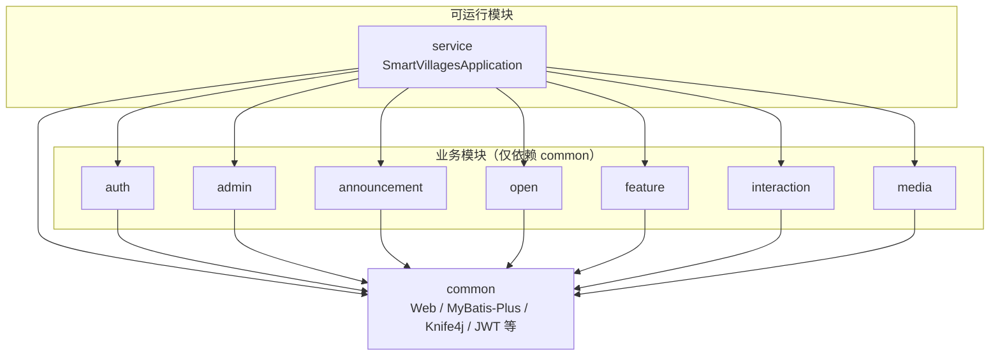

# 智慧乡村后端（smartVillages）

## 工程概览

根工程 Maven 坐标为 `com.backend:smartVillages`，采用 **多模块 + 单 Spring Boot 进程**（`service` 模块打包可执行 jar）。  
各业务 jar **只依赖 `common`**；`common` 收敛 Web / MyBatis-Plus / Knife4j(OpenAPI) / JWT 等共用能力。根包名为 **`com.backend.*`**（与旧文档中的 `com.blogbackend` / 单体 `modules` 目录已不一致）。

### 仓库目录（Maven 模块）

```text
smartVillages/                          # 父工程（packaging=pom）
├── pom.xml
├── common/                             # 公共模块（无启动类）
│   └── src/main/java/com/backend/common/
│       ├── config/                     # OpenAPI 元信息、MyBatis-Plus、CORS、拦截器等
│       ├── exception/                  # GlobalExceptionHandler
│       ├── filter/                     # CharacterEncodingFilter
│       ├── result/                     # Result
│       └── utils/                      # JwtUtils
├── auth/                               # 1. 认证（包：com.backend.auth）
├── admin/                              # 2. 后台用户
├── announcement/                       # 3. 村务公告
├── open/                               # 4. 村务公开
├── feature/                            # 5. 乡村风采
├── interaction/                        # 6. 村民留言
├── media/                              # 7. 媒体资源
└── service/                            # 启动与配置（聚合全部模块）
    ├── pom.xml                         # 依赖 common + 上述业务模块 + MySQL 驱动
    └── src/main/
        ├── java/com/backend/
        │   └── SmartVillagesApplication.java
        ├── resources/
        │   ├── application.yml
        │   └── sql/                    # 表结构/初始化脚本
        └── test/java/com/backend/
            └── SmartVillagesApplicationTests.java
```

### 业务模块内代码分层（每个 Maven 子模块相同约定）

每个业务模块的路径形如：`模块名/src/main/java/com/backend/<模块名>/`，下挂典型分层（具体类以仓库为准）：

```text
<模块>/
├── controller/
├── service/
│   └── impl/
├── mapper/
├── entity/
└── dto/                                # 按需
```

### 7 个模块详细介绍

#### 1️⃣ auth 模块 - 认证中心
**功能：** JWT 登录、角色权限验证

**核心功能：**
- 用户登录（账号密码/手机号）
- JWT Token 生成和验证
- 用户登出
- Token 刷新
- 权限拦截

**数据表：** `auth`（用户认证表）
- 字段：id, username, password, role, status

**使用场景：**
- 所有需要登录的接口都要先通过 auth 模块验证
- 根据角色（管理员/村干部/村民）控制访问权限

---

#### 2️⃣ admin 模块 - 后台用户管理
**功能：** 超级管理员管理

**核心功能：**
- 管理员信息管理
- 管理员角色分配
- 管理员账号增删改查
- 权限配置

**数据表：** `admin`（管理员表）
- 字段：id, username, password, role, permissions, status

**使用场景：**
- 系统管理员登录后台管理系统
- 分配其他管理员的管理权限
- 管理村干部账号

---

#### 3️⃣ announcement 模块 - 村务公告管理
**功能：** 带审核、上下架、置顶的公告

**核心功能：**
- 发布公告
- 公告审核（待审核→已通过/已拒绝）
- 公告上下架
- 公告置顶
- 公告分类（通知、公告、公示）

**数据表：** `announcement`（村务公告表）
- 字段：id, title, content, type, status, is_top, create_time, audit_time

**使用场景：**
- 村委会发布停水停电通知
- 发布政策公告
- 村务公开公示
- 重要活动通知

---

#### 4️⃣ open 模块 - 村务公开
**功能：** 审核/上下架管理

**核心功能：**
- 村务信息公开
- 财务公开（收入、支出明细）
- 项目公开（工程建设、招投标）
- 政策公开
- 审核流程

**数据表：** `open`（村务公开表）
- 字段：id, title, content, category, amount, attachments, status

**使用场景：**
- 村级财务收支公开
- 扶贫资金使用公开
- 建设项目招投标信息公开
- 低保名单公示

---

#### 5️⃣ feature 模块 - 乡村风采
**功能：** 乡村风采、产业介绍

**核心功能：**
- 乡村介绍管理
- 风景图片展示
- 特色产业介绍
- 历史文化展示
- 相册管理

**数据表：** `feature`（乡村风采表）
- 字段：id, title, content, images, type, sort, status

**使用场景：**
- 展示乡村自然风光
- 介绍特色农产品
- 宣传乡村旅游资源
- 展示乡村文化建设成果

---

#### 6️⃣ interaction 模块 - 村民留言/反馈
**功能：** 带状态（新建/已回复/关闭）

**核心功能：**
- 村民留言提交
- 留言分类（咨询、投诉、建议）
- 官方回复
- 状态跟踪（新建→处理中→已回复→已关闭）
- 留言评价

**数据表：** `interaction`（村民留言表）
- 字段：id, user_id, content, type, reply, status, create_time, reply_time

**使用场景：**
- 村民咨询政策
- 投诉村务问题
- 提出发展建议
- 反映民生问题

---

#### 7️⃣ media 模块 - 媒体资源
**功能：** 图片上传、轮播图、富文本

**核心功能：**
- 文件上传（图片/视频/文档）
- 文件分类管理
- 轮播图管理
- 富文本内容存储
- 文件访问控制

**数据表：** `media`（媒体资源表）
- 字段：id, file_name, file_url, file_type, file_size, upload_user, status

**使用场景：**
- 公告配图上传
- 轮播图管理
- 村务公开附件
- 乡村风采照片墙

---

### 模块关系图

依赖方向：**业务模块 → common**；**service → common + 全部业务模块**（运行时一个进程加载所有 jar）。



**开发与打包：** 在仓库根目录执行 `mvn clean package`，可执行 jar 位于 `service/target/`。
